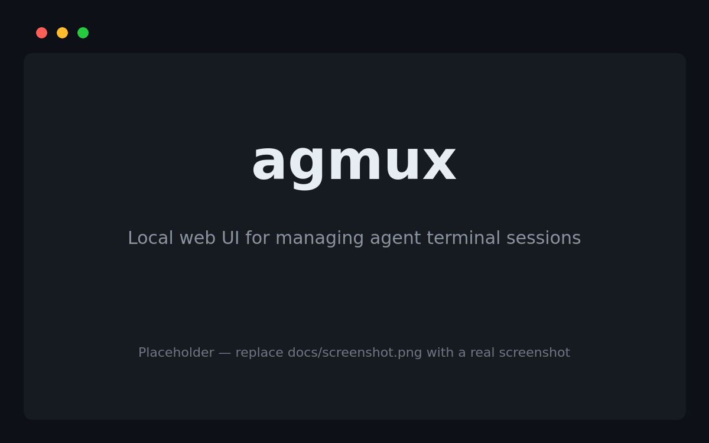

# agmux

[](https://github.com/rjprins/agmux/actions/workflows/ci.yml)
[](https://www.npmjs.com/package/@rjprins/agmux)
[](https://nodejs.org)
[](LICENSE)

Local web UI for managing agent terminal sessions. Streams PTY output to the browser over WebSockets, with customizable triggers and Claude/Codex readiness callbacks backed by tmux pane inference fallback.

Built for managing [Claude Code](https://docs.anthropic.com/en/docs/claude-code), [Codex](https://github.com/openai/codex), and other CLI-based coding agents — but works with any terminal program.

<p align="center">
  
</p>

<!--
  docs/screenshot.png is a generated placeholder. Drop a real screenshot at the
  same path (ideally ~1200px wide) and it will appear here — no README edit needed.
-->

## Features

- **Web-based terminal viewer** — real-time PTY output streamed via WebSockets
- **tmux-backed sessions** — agent sessions survive server restarts
- **Trigger system** — pattern-match on terminal output and run custom actions
- **Agent readiness** — Claude hooks and Codex notify callbacks mark sessions ready, with tmux pane inference as fallback
- **Inactive session discovery** — include recent Claude/Codex/Pi JSONL sessions in the inactive list
- **Themeable UI** — 5 built-in themes
- **Multi-worktree support** — manage multiple git worktrees from one interface

## Install

agmux is distributed on npm as `@rjprins/agmux` and installs an `agmux` command.

**Prerequisites:** **Node.js 22+**, **tmux** (the default session backend), and a
**C++ toolchain** — agmux's `better-sqlite3` and `node-pty` dependencies build
native addons during install.

```sh
# Debian/Ubuntu
sudo apt install tmux build-essential
# macOS
brew install tmux   # plus the Xcode Command Line Tools: xcode-select --install
```

See [docs/dependencies.md](docs/dependencies.md) for the full list.

Then install agmux globally and run it:

```sh
npm install -g @rjprins/agmux
agmux
```

…or run it without installing:

```sh
npx @rjprins/agmux
```

agmux serves the UI at `http://127.0.0.1:4821` and opens your browser (set
`AGMUX_NO_OPEN=1` to skip). **Run it from the project directory you want to
manage** — the session database (`data/agmux.db`) and triggers
(`triggers/index.js`) are resolved relative to the current directory, and git
worktree detection uses the surrounding repository.

If the port is taken, pick another:

```sh
PORT=4823 agmux
```

> **Node version note:** native dependencies ship prebuilt binaries for current
> Node releases (22, 24). On a brand-new major before those prebuilds exist, the
> install will fall back to compiling from source (and may fail until the
> dependencies add support).

## Run from source

To develop agmux or run it from a checkout:

```sh
git clone https://github.com/rjprins/agmux.git
cd agmux
npm install
npm run dev      # build the UI + run with auto-rebuild and auto-reload
```

App: `http://127.0.0.1:4821`. Other commands:

- `npm run app` — build the UI and run once (no file watching)
- `npm run build` — compile to `dist/` and bundle the UI into `public/`
- `npm start` — run the compiled build from `dist/`

## Triggers

Edit `triggers/index.js`. The server watches the `triggers/` folder and hot-reloads on change.

An example trigger is included that highlights the PTY in the UI when a `proceed (y)?` prompt is detected.

Trigger `onMatch(ctx)` handlers can also orchestrate other sessions via `ctx.hooks`:

- `ctx.hooks.writeTo(ptyId, data)` — write input to another running PTY
- `ctx.hooks.listPtys()` — inspect current PTY summaries
- `ctx.hooks.spawnShell({ cwd?, name? })` — spawn a new tmux-backed shell PTY

## Agent API

Use the current UI API surface directly for agents:

- HTTP + WS reference: [docs/agent-api-reference.md](docs/agent-api-reference.md)
- OpenAPI spec: [docs/openapi.json](docs/openapi.json)
- MCP server: [docs/mcp.md](docs/mcp.md)

## Claude / Codex readiness

Claude and Codex callbacks are the preferred readiness signal. If those callbacks are not configured or do not fire, agmux falls back to the original tmux pane-based readiness inference.

A PTY becomes `ready` immediately when:

- Claude Code fires a `Notification` hook such as `idle_prompt` or `permission_prompt`
- Codex runs its `notify` callback after a turn completes

Without an explicit callback, agmux still infers readiness from visible tmux pane state:

- changing pane content keeps the PTY `busy`
- a stable prompt long enough marks the PTY `ready`
- visible permission prompts also count as `ready`

Every agmux-created shell exports these variables:

- `AGMUX_PTY_ID`
- `AGMUX_TMUX_SESSION`
- `AGMUX_API_BASE`
- `AGMUX_READY_HELPER`
- `AGMUX_TOKEN` when token auth is enabled

Example Claude hooks:

```json
{
  "hooks": {
    "Notification": [
      {
        "matcher": "idle_prompt",
        "hooks": [
          {
            "type": "command",
            "command": "node \"$AGMUX_READY_HELPER\" claude idle_prompt"
          }
        ]
      },
      {
        "matcher": "permission_prompt",
        "hooks": [
          {
            "type": "command",
            "command": "node \"$AGMUX_READY_HELPER\" claude permission_prompt"
          }
        ]
      }
    ]
  }
}
```

Example Codex config:

```toml
notify = ["node", "/absolute/path/to/agmux/scripts/agent-ready.mjs", "codex", "turn_complete"]
```

Using the exported helper is preferred inside agmux-created shells because it already knows the current PTY and auth token.

## Configuration

Environment variables:

| Variable | Default | Description |
|---|---|---|
| `HOST` | `127.0.0.1` | Server bind address |
| `PORT` | `4821` | Server port |
| `DB_PATH` | `data/agmux.db` | SQLite database path |
| `TRIGGERS_PATH` | `triggers/index.js` | Trigger definitions file |
| `AGMUX_TOKEN_ENABLED` | `false` | Enable auth token enforcement for `/api/*` and `/ws` |
| `AGMUX_TOKEN` | *(generated if enabled and unset)* | Auth token value when `AGMUX_TOKEN_ENABLED=1` |
| `AGMUX_LOG_LEVEL` | `warn` | Fastify log level (`fatal`,`error`,`warn`,`info`,`debug`,`trace`) |
| `AGMUX_SHELL` | `$SHELL` or `bash` | Shell for PTY sessions |
| `AGMUX_SHELL_BACKEND` | `tmux` | PTY backend: `tmux` or `pty` |
| `AGMUX_NO_OPEN` | `false` | Skip auto-opening browser |
| `AGMUX_ALLOW_NON_LOOPBACK` | `false` | Allow binding to non-localhost addresses |
| `AGMUX_ALLOWED_ORIGINS` | | Additional WebSocket origins (comma-separated) |
| `AGMUX_INACTIVE_MAX_AGE_HOURS` | `24` | Hide non-running sessions older than this |
| `AGMUX_LOG_SESSION_DISCOVERY` | `1` | Enable/disable inactive discovery from JSONL logs |
| `AGMUX_LOG_SESSION_SCAN_MAX` | `500` | Max JSONL files scanned per discovery refresh |
| `AGMUX_LOG_SESSION_CACHE_MS` | `5000` | Cache lifetime for discovered log sessions |
| `CLAUDE_CONFIG_DIR` | `~/.claude` | Root used for Claude log discovery |
| `CODEX_HOME` | `~/.codex` | Root used for Codex log discovery |
| `PI_HOME` | `~/.pi` | Root used for Pi log discovery |

### Optional auth token

By default, agmux does **not** require an auth token.

To enable auth explicitly, set `AGMUX_TOKEN_ENABLED=1`:

```sh
AGMUX_TOKEN_ENABLED=1 npm run app
```

With `AGMUX_TOKEN_ENABLED=1`:

- if `AGMUX_TOKEN` is set, that value is used
- if `AGMUX_TOKEN` is unset, agmux generates a random token at startup

When token auth is enabled:

- all `/api/*` endpoints require the token (`x-agmux-token` header, `Authorization: Bearer`, or `?token=...`)
- WebSocket `/ws` requires the token
- browser auto-open includes `?token=...` automatically
- startup logs print a clear token/auth status message

See `docs/auth-token.md` for details and examples.

## Testing

```sh
# Unit tests
npm test

# E2E tests (Playwright)
npm run e2e

# E2E with browser visible
npm run e2e:headed
```

By default, E2E tests use Playwright's managed Chromium. Set `PLAYWRIGHT_CHROMIUM_PATH` to use a system browser instead.

To install Playwright's browser:
```sh
npx playwright install chromium
```

## Notes

- Plain PTYs (created via `/api/ptys`) are not persistent — if the Node server stops, those processes stop too.
- The default "New PTY" shell is tmux-backed, so it survives server restarts.
- Click an inactive session row to attempt resume/re-attach.
- WebSocket output is batched (~16ms flush interval) for performance.

## Contributing

See [CONTRIBUTING.md](CONTRIBUTING.md) for development setup and guidelines.

## Security

See [SECURITY.md](SECURITY.md) for reporting vulnerabilities. agmux runs terminal sessions — please report security issues responsibly.

## License

[MIT](LICENSE)
